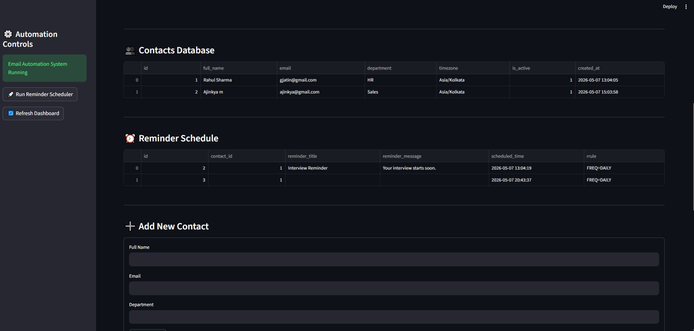
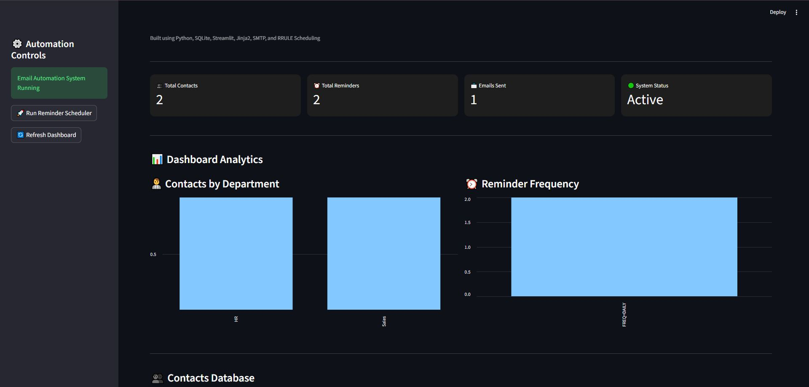

# 📧 Email Automation & Reminder System

An industry-style Email Automation & Reminder System built using Python, SQLite, Streamlit, Jinja2, SMTP, and RRULE scheduling.

This project automates reminder scheduling, email rendering, analytics visualization, and email dispatching through a modern interactive dashboard.

---

# 🚀 Features

✅ Email Automation System  
✅ SMTP Email Sending  
✅ RRULE Reminder Scheduling  
✅ SQLite Database Integration  
✅ Streamlit Dashboard  
✅ Jinja2 Email Templates  
✅ Markdown → HTML Rendering  
✅ Interactive Analytics Dashboard  
✅ Reminder Scheduling System  
✅ Contacts Management  
✅ Add Contact Forms  
✅ Reminder Analytics Charts  
✅ Premium Dark UI  
✅ Dashboard Controls  
✅ Automated Reminder Workflow  

---

# 📊 Dashboard Preview

## Main Dashboard



---

## Analytics Section



---

# 🛠️ Technologies Used

- Python
- Streamlit
- SQLite
- Pandas
- Matplotlib
- Jinja2
- SMTP
- Python-Dateutil
- Markdown

---

# 📂 Project Structure

```plaintext
Email-Automation-Reminder-System/
│
├── dashboard.py
├── schedular.py
├── mailer.py
├── renderer.py
├── requirements.txt
├── README.md
│
├── db/
│   └── email_automation.db
│
├── templates/
│   └── reminder.md
│
├── screenshots/
│   ├── dashboard.JPG
│   └── Analytics.JPG
│
├── __pycache__/
│
└── .gitignore
```

---

# ⚙️ Installation

## Clone Repository

```bash
git clone https://github.com/jatingujju/Email-Automation-Reminder-System.git
```

---

## Install Dependencies

```bash
pip install -r requirements.txt
```

---

# ▶️ Run Dashboard

```bash
streamlit run dashboard.py
```

---

# 📧 Email Workflow

```plaintext
Database
   ↓
Reminder Scheduler
   ↓
RRULE Processing
   ↓
Jinja2 Template Rendering
   ↓
Markdown → HTML Conversion
   ↓
SMTP Email Dispatch
   ↓
Real Email Delivery
```

---

# 📈 Dashboard Features

- Contacts Database Management
- Reminder Scheduling
- Reminder Frequency Analytics
- Department Distribution Charts
- Add New Contact Form
- Scheduler Trigger Controls
- Dashboard Refresh System
- Interactive Charts & Tables
- Real-time Metrics
- Premium Sidebar UI

---

# 🔐 Security

Sensitive files are excluded using `.gitignore`

```gitignore
.env
__pycache__/
```

---

# 📌 Future Improvements

- User Authentication
- Cloud Deployment
- Email History Tracking
- Auto Scheduler Execution
- Notification System
- AI-based Reminder Suggestions
- REST API Integration
- Multi-user Support

---

# 👨‍💻 Author

Developed by **Jatin Gujarathi**

---

# ⭐ Support

If you like this project, give this repository a ⭐ on GitHub.
